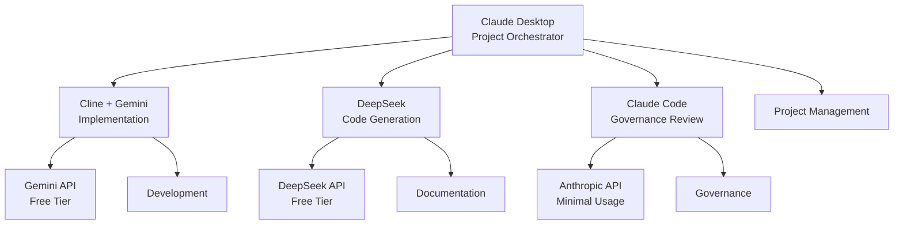

# Claude Desktop Setup: IDP Concierge v2.0 Development

**Project**: IDP Concierge v2.0 Enhanced User Interface
**Lead Platform**: Claude Desktop (Cost-Optimized)
**Supporting Agents**: Cline, Gemini, DeepSeek (Free APIs)
**Timeline**: 5 weeks, Phase 1 starting immediately

## Cost-Optimization Strategy

### Primary Development Stack (Minimized Anthropic API Usage)
1. **Claude Desktop**: Project management, architecture decisions, code reviews
2. **Cline + Gemini**: Implementation, testing, debugging (Free Gemini API)
3. **DeepSeek**: Code generation, documentation (Free tier)
4. **Claude Code**: Critical reviews and governance compliance only

### Resource Allocation by Phase
- **Phase 1 (CLI Enhancement)**: 70% Cline+Gemini, 30% Claude Desktop
- **Phase 2 (Web Interface)**: 60% Cline+Gemini, 40% Claude Desktop  
- **Phase 3 (AI Components)**: 50% Cline+Gemini, 50% Claude Desktop
- **Phase 4 (Integration)**: 80% Cline+Gemini, 20% Claude Desktop

## Multi-Agent Workflow Architecture



## Project Files Structure

```
/home/ichardart/idp-projects/concierge-v2/
├── project-management/
│   ├── project-charter.md
│   ├── phase-plans/
│   └── progress-tracking.md
├── architecture/
│   ├── system-design.md
│   ├── component-specs/
│   └── api-specifications.md
├── development/
│   ├── phase1-cli-enhancement/
│   ├── phase2-web-interface/
│   ├── phase3-ai-components/
│   └── phase4-integration/
├── governance/
│   ├── compliance-checklist.md
│   ├── security-review.md
│   └── testing-standards.md
└── documentation/
    ├── user-guides/
    ├── technical-docs/
    └── api-documentation/
```