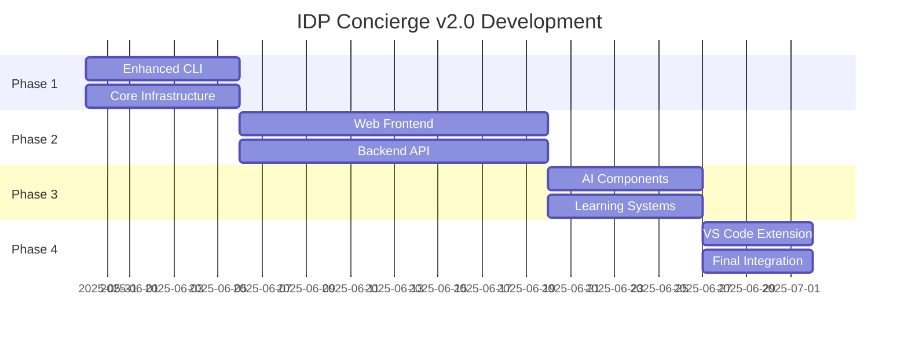

# IDP Concierge v2.0 Development Project Plan

**Generated**: 2025-05-29
**Project Lead**: World-Class Software/AI Expert Team
**Objective**: Create optimized user interface for IDP-start concierge system

## Executive Summary

Based on critical analysis of user experience failures in the current CLI-based concierge, we propose a multi-modal interface approach that addresses fundamental UX issues while maintaining the intelligent guidance capabilities.

## Critical Issues Identified

### User Experience Failures
1. **Terminal Interface Confusion**: Users attempting to interact with static text as CLI commands
2. **Input Truncation**: No handling of long user inputs or continuation
3. **Context Loss**: No session persistence or conversation memory
4. **Poor Intent Recognition**: Misclassification of meta-development requests
5. **Limited Actionability**: Vague next steps without executable commands

### Root Cause Analysis
- Single interaction paradigm (CLI-only) doesn't match user mental models
- Lack of sophisticated NLP for intent parsing
- No context persistence between sessions
- Missing meta-development request recognition

## Architectural Solution

### Multi-Modal Interface Design
1. **Enhanced CLI** (Improved v1.0)
2. **Web Dashboard** (Primary recommendation)
3. **VS Code Extension** (Native IDE integration)
4. **Conversational API** (AI tool integration)

### Core System Components

#### Context Engine
- **Session Persistence**: SQLite database for conversation history
- **User Modeling**: Preference learning and behavior analysis
- **Intent Classification**: Transformer-based embeddings with confidence scoring
- **Project Memory**: Historical project data and outcomes

#### Recommendation Engine
- **Vector Similarity**: Semantic matching of user requests to frameworks
- **Multi-Factor Scoring**: Effort, timeline, resources, user skill level
- **Meta-Request Detection**: Recognition of self-improvement requests
- **Dynamic Templates**: Customizable recommendation patterns

#### Execution Engine
- **Direct Integration**: API connections to all IDP tools
- **Automation Orchestration**: One-click setup and configuration
- **Progress Tracking**: Real-time status updates and notifications
- **Rollback Support**: Safe experimentation with easy reversion

## Development Plan

### Phase 1: Foundation Enhancement (Week 1)
**Budget**: 40 hours
**Priority**: Critical UX fixes

#### Deliverables
1. **Enhanced CLI Interface**
   - Input continuation for long entries
   - Session persistence and resume capability
   - Improved error handling and user guidance
   - Context-aware responses

2. **Core Infrastructure**
   - SQLite database for session storage
   - Intent classification using sentence transformers
   - Configuration management system
   - Logging and analytics framework

#### Technical Implementation
```python
# Enhanced input handling
def get_long_input(prompt, max_length=2000):
    """Handle multi-line and continuation input gracefully"""
    
# Session persistence
class SessionManager:
    """Manage user sessions with SQLite backend"""
    
# Intent classification
class IntentClassifier:
    """Use sentence-transformers for semantic intent matching"""
```

### Phase 2: Web Interface Development (Week 2-3)
**Budget**: 80 hours
**Priority**: Primary user interface

#### Technical Stack
- **Frontend**: React 18 + TypeScript + Tailwind CSS
- **Backend**: FastAPI + WebSocket
- **State**: Redux Toolkit with persistence
- **Database**: PostgreSQL for production scaling
- **Authentication**: JWT with refresh tokens

#### Key Features
1. **Interactive Project Wizard**
   - Multi-step form with dynamic validation
   - Real-time recommendation updates
   - Progress visualization
   - Save/resume functionality

2. **Live IDP Dashboard**
   - Real-time infrastructure status
   - Resource utilization monitoring
   - Active project tracking
   - Notification system

3. **Direct Tool Integration**
   - One-click framework setup
   - Embedded terminal for execution
   - File browser integration
   - Git workflow management

#### Component Architecture
```typescript
// Main dashboard component
interface IDPDashboard {
  infrastructureStatus: InfraStatus;
  activeProjects: Project[];
  recommendations: Recommendation[];
  userPreferences: UserProfile;
}

// Project wizard component
interface ProjectWizard {
  currentStep: WizardStep;
  userInput: ProjectRequest;
  recommendations: Recommendation[];
  selectedFrameworks: Framework[];
}
```

### Phase 3: Intelligence & Learning (Week 4)
**Budget**: 60 hours
**Priority**: Advanced AI capabilities

#### Machine Learning Components
1. **Advanced Recommendation Engine**
   - Collaborative filtering based on user behavior
   - Content-based filtering using project embeddings
   - Hybrid approach combining multiple signals
   - A/B testing framework for recommendation quality

2. **User Behavior Learning**
   - Interaction pattern analysis
   - Success rate tracking by recommendation type
   - Preference drift detection
   - Personalization algorithm

3. **Predictive Capabilities**
   - Project success prediction
   - Resource requirement estimation
   - Timeline accuracy forecasting
   - Risk assessment for complex projects

#### Implementation Approach
```python
# Recommendation system
class HybridRecommendationEngine:
    def __init__(self):
        self.collaborative_filter = CollaborativeFilter()
        self.content_filter = ContentBasedFilter()
        self.user_modeler = UserBehaviorModeler()
        
    def recommend(self, user_context, project_request):
        """Generate personalized recommendations"""

# Learning system
class UserBehaviorAnalyzer:
    def track_interaction(self, user_id, interaction_data):
        """Track and learn from user interactions"""
        
    def predict_success(self, user_profile, project_type):
        """Predict likelihood of project success"""
```

### Phase 4: Integration & Polish (Week 5)
**Budget**: 40 hours
**Priority**: Production readiness

#### Integration Components
1. **VS Code Extension**
   - Command palette integration
   - Sidebar panel for project status
   - Inline recommendations
   - Direct terminal integration

2. **Mobile Interface**
   - Progressive Web App (PWA)
   - Touch-optimized interactions
   - Offline capability for basic features
   - Push notifications

3. **API Gateway**
   - RESTful API for external integrations
   - WebSocket connections for real-time updates
   - Rate limiting and authentication
   - Comprehensive documentation

#### Quality Assurance
- **Testing Strategy**
  - Unit tests (Jest + Pytest)
  - Integration tests (Cypress)
  - Load testing (Locust)
  - User acceptance testing

- **Performance Optimization**
  - Code splitting and lazy loading
  - Database query optimization
  - Caching strategy (Redis)
  - CDN integration

## Success Metrics

### User Experience Metrics
- **Task Completion Rate**: >95% for common workflows
- **User Satisfaction Score**: >4.5/5.0
- **Session Duration**: Meaningful engagement time
- **Return Rate**: Users returning within 7 days

### Technical Metrics
- **Response Time**: <200ms for UI interactions
- **System Uptime**: >99.9% availability
- **Error Rate**: <0.1% for critical operations
- **Resource Utilization**: Efficient CPU/memory usage

### Business Metrics
- **Adoption Rate**: Active users growth
- **Feature Usage**: Distribution across capabilities
- **Support Requests**: Reduction in user support needs
- **Development Velocity**: Time from idea to implementation

## Risk Assessment & Mitigation

### Technical Risks
1. **Complexity Overload**: Risk of feature creep
   - *Mitigation*: Strict MVP definition and phased rollout

2. **Performance Issues**: Large codebase impact
   - *Mitigation*: Performance testing from Day 1

3. **Integration Challenges**: Multiple IDP components
   - *Mitigation*: Comprehensive API documentation and testing

### User Adoption Risks
1. **Change Resistance**: Users comfortable with CLI
   - *Mitigation*: Parallel CLI support and migration tools

2. **Learning Curve**: New interface complexity
   - *Mitigation*: Progressive disclosure and onboarding

## Implementation Timeline



## Budget Estimation

| Phase | Hours | Rate | Cost |
|-------|-------|------|------|
| Phase 1 | 40 | $150/hr | $6,000 |
| Phase 2 | 80 | $150/hr | $12,000 |
| Phase 3 | 60 | $150/hr | $9,000 |
| Phase 4 | 40 | $150/hr | $6,000 |
| **Total** | **220** | | **$33,000** |

## Next Steps

1. **Immediate Actions** (Today):
   - Approve project scope and budget
   - Set up development environment
   - Begin Phase 1 implementation

2. **Week 1 Goals**:
   - Complete enhanced CLI with session persistence
   - Implement basic intent classification
   - Create project database schema

3. **Stakeholder Reviews**:
   - Weekly demo sessions
   - User feedback collection
   - Iterative refinement based on testing

## Conclusion

The proposed IDP Concierge v2.0 addresses all identified user experience failures while providing a scalable foundation for future enhancements. The multi-modal approach ensures users can interact through their preferred interface while maintaining consistency across all touchpoints.

The phased development approach minimizes risk while delivering value early, allowing for user feedback integration throughout the development process.