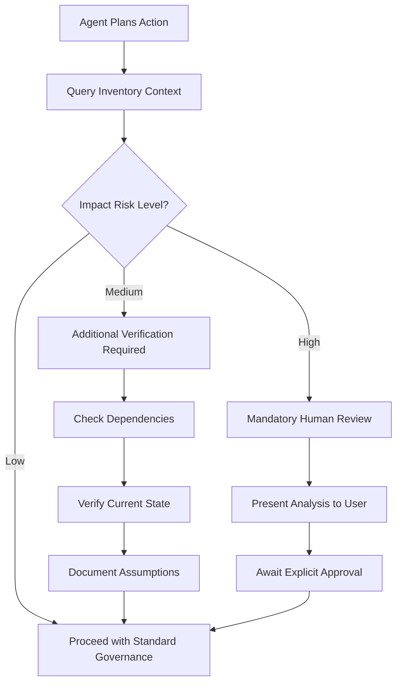

# Agent Awareness Protocol for Dynamic Inventory

## 🎯 Core Principle

**Inventory as Intelligence, Not Truth**: Agents must use inventory data to guide investigation and decision-making, never as determinative facts.

## 📋 Mandatory Agent Queries

### Before Any Filesystem Operations

```python
# 1. Get Current Context
context = inventory.get_context(current_working_directory)

# 2. Analyze Impact of Proposed Changes  
impact = inventory.analyze_impact(target_paths, change_type)

# 3. Check Dependencies
dependencies = inventory.get_dependencies(target_path, direction='both')
```

### Risk-Based Decision Tree



## 🔧 Implementation in Agent Prompts

### Standard Pre-Action Protocol

```
MANDATORY INVENTORY CHECK:
Before any filesystem operation, you MUST:

1. Query inventory context: get_inventory_context(target_path)
2. Analyze impact: analyze_impact([paths], change_type)
3. If risk_level == 'high': Require explicit user confirmation
4. If dependencies.length > 0: Review and document impact
5. Always use inventory as guidance for further investigation

CRITICAL: Never assume inventory data is current or complete.
Use it to determine what additional checks are needed.
```

### Context-Aware Decision Making

```
INVENTORY-GUIDED WORKFLOW:
1. Consult inventory for baseline understanding
2. Verify current state independently  
3. Cross-reference governance scores with actual files
4. Document any discrepancies found
5. Proceed with heightened awareness of potential impacts

Remember: Inventory informs your investigation strategy,
not your final decisions.
```

## 🎯 Agent Training Examples

### Example 1: File Creation in Unknown Directory

```bash
Agent Task: Create new config file in /home/ichardart/idp-projects/new-project/

Agent Process:
1. inventory.get_context('/home/ichardart/idp-projects/new-project/')
   Result: No inventory data found

2. Agent Response: 
   "Inventory shows no data for this path. I need to:
   - Check if directory exists
   - Analyze parent directory governance
   - Assess if this affects other IDP components
   - Create with appropriate governance awareness"

3. inventory.analyze_impact(['/home/ichardart/idp-projects/new-project/'], 'create')
   Result: Medium risk - new project in IDP ecosystem

4. Agent Action: Creates file with governance-aware defaults
```

### Example 2: Deleting High-Risk Directory

```bash
Agent Task: Remove /home/ichardart/idp-projects/critical-service/

Agent Process:
1. inventory.get_context('/home/ichardart/idp-projects/critical-service/')
   Result: High governance score, active dependencies

2. inventory.get_dependencies(path, 'incoming')
   Result: 3 projects depend on this directory

3. Agent Response:
   "⚠️ HIGH RISK OPERATION DETECTED
   
   Inventory analysis shows:
   - Governance score: 85% (well-managed project)
   - 3 incoming dependencies detected
   - Active project classification
   
   I CANNOT proceed without explicit confirmation.
   Please review dependencies and confirm deletion."

4. Requires user approval before proceeding
```

## 🔄 Inventory Update Triggers

### When Agents Must Trigger Updates

1. **After Major Operations**: Creating/deleting directories, moving projects
2. **Discovery of Discrepancies**: When inventory doesn't match reality
3. **New Project Detection**: When working in previously unknown areas
4. **Governance Changes**: After updating manifests, governance files

### Update Command
```python
inventory.trigger_update(['/path/to/changed/directory'])
```

## 🏛️ Integration with Governance

### Pre-Commit Hook Integration

```bash
#!/bin/bash
# Enhanced pre-commit with inventory awareness

# Check if changes affect high-risk areas
CHANGED_DIRS=$(git diff --cached --name-only | xargs -I {} dirname {} | sort -u)

for dir in $CHANGED_DIRS; do
    # Query inventory for each changed directory
    risk_level=$(inventory-cli.py get-risk "$dir")
    
    if [[ "$risk_level" == "high" ]]; then
        echo "⚠️ GOVERNANCE: High-risk directory modification detected: $dir"
        echo "📋 Review inventory analysis before committing"
        # Could block commit or require additional verification
    fi
done
```

### MCP Server Registration

Add to Cline configuration:
```json
{
  "mcpServers": {
    "inventory-mcp": {
      "command": "node",
      "args": ["/home/ichardart/code/infra/mcp-servers/inventory-mcp/index.js"],
      "disabled": false,
      "autoApprove": []
    }
  }
}
```

## 📊 Success Metrics

### Agent Compliance Indicators

1. **Query Rate**: >90% of filesystem operations preceded by inventory queries
2. **Risk Recognition**: 100% of high-risk operations flagged for review
3. **Update Trigger**: Agents trigger updates within 5 minutes of major changes
4. **Decision Quality**: Reduced incidents due to unaware modifications

### Monitoring Commands

```bash
# Check agent inventory usage
grep "get_inventory_context" /home/ichardart/code/infra/logs/mcp-*.log

# Verify update triggers
grep "trigger_update" /home/ichardart/code/infra/logs/filesystem-watcher.log

# Risk assessment accuracy
inventory-cli.py audit-agent-decisions --last-week
```

## 🚨 Failure Modes and Recovery

### When Inventory is Unavailable

```
FALLBACK PROTOCOL:
If inventory MCP server is down:
1. Switch to "Conservative Governance Mode"
2. Treat all operations as medium-risk
3. Require additional verification steps
4. Document all actions for post-recovery analysis
```

### Inventory-Reality Discrepancies

```
DISCREPANCY HANDLING:
When inventory doesn't match filesystem:
1. Document the discrepancy
2. Trust filesystem over inventory
3. Trigger immediate inventory update
4. Proceed with heightened caution
5. Report to governance logs
```

This protocol ensures agents are inventory-aware while maintaining intelligent decision-making capabilities.